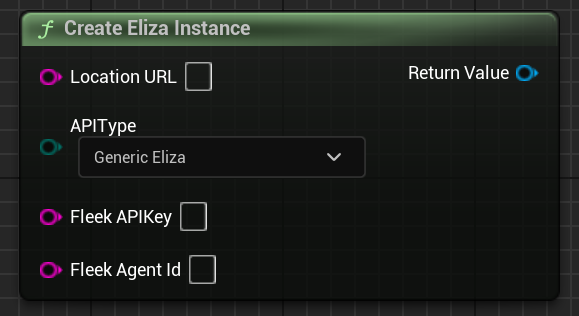

Sends a message to an agent.

# Inputs

| - | - | - |
|Type|Name|Description|
|FString|LocationURL|The URL of where the Eliza instance is. Usually "http://localhost:3000" if you're self hosting. Not used if you specify Fleek in the APIType.|
|EElizaAPIType|APIType|If this is a normal Eliza instance or a Fleek Eliza instance.|
|FString|FleekAPIKey|A Fleek API key. NOT a bearer token!|
|FString|FleekAgentId|The Fleek agent ID. Not the Fleek Eliza agent ID!|

# Outputs

| - | - | - |
|Type|Name|Description|
|UElizaInstance*|Return value|The created Eliza Instance.|

# C++
Module: `Eliza`
include: `#include "ElizaInstance.h"`

`static UElizaInstance* UElizaInstance::CreateElizaInstance(FString LocationURL, EElizaAPIType APIType, FString FleekAPIKey, FString FleekAgentId)` - This method.
