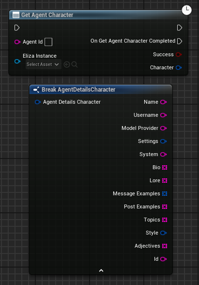

Given an AgentId, returns details about a the character that agent is representing from its character file.

# Inputs

| - | - | - |
|Type|Name|Description|
|FString|AgentId|The ID string of the agent to get the character data of.|
|UElizaInstance\*|ElizaInstance|The Eliza instance to communicate with.|

# Outputs

| - | - | - |
|Type|Name|Description|
|bool|Success|If this method was a HTTP success, usable as a quick check to see if it immediately failed.|
|FAgentDetails|Agent|The character of the agent as a struct. See the above image for more details of the structs.|

# C++
Module: `Eliza`
include: `#include "GetAgentCharacter.h"`

`UGetAgentCharacter::GetAgentCharacter(FString AgentId, UElizaInstance* ElizaInstance)` - instantiates this async method.
`Activate()` - Activates this async method.
In C++, the outputs of the async function can be acted upon by binding to the event delegate "`OnGetAgentCharacterCompleted`".
