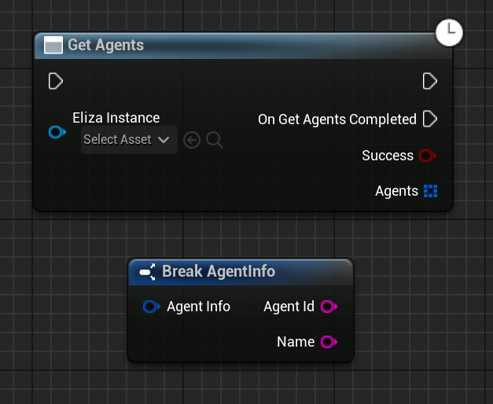

Returns an array of all the agents running in your Eliza instance.

# Inputs

| - | - | - |
|Type|Name|Description|
|FString|AgentId|The ID string of the agent to send the message to.|
|FString|Message|The message to send to the agent.|

# Outputs

| - | - | - |
|Type|Name|Description|
|bool|Success|If this method was a HTTP success, usable as a quick check to see if it immediately failed.|
|TArray<FAgentInfo>|Agents|An array of Agent Info structs. These contain information about the Agents in the eliza instance.|

# C++
Module: `Eliza`
include: `#include "GetAgents.h"`

`UGetAgents::GetAgents()` - instantiates this async method.
`Activate()` - Activates this async method.
In C++, the outputs of the async function can be acted upon by binding to the event delegate "`OnGetAgentsCompleted`".
