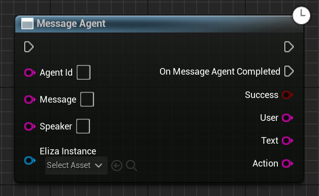

Sends a message to an agent.

# Inputs

| - | - | - |
|Type|Name|Description|
|FString|AgentId|The ID string of the agent to send the message to.|
|FString|Message|The message to send to the agent.|
|FString|Speaker|Who is the speaker of this message, who is talking. This is useful if you're trying to create a three-way (or more) conversation. Leave blank to be the default speaker.|
|UElizaInstance\*|ElizaInstance|The Eliza instance to communicate with.|

# Outputs

| - | - | - |
|Type|Name|Description|
|bool|Success|If this method was a HTTP success, usable as a quick check to see if it immediately failed.|
|FString|User||
|FString|Text|The text returned by the Eliza AI, usually representing what the AI is saying in response to what you sent as a message.|
|FString|Action|Any actions the AI tried to perform.|

# C++
Module: `Eliza`
include: `#include "MessageAgent.h"`

`UMessageAgent::MessageAgent(FString AgentId, FString Message, UElizaInstance* ElizaInstance)` - instantiates this async method.
`Activate()` - Activates this async method.
In C++, the outputs of the async function can be acted upon by binding to the event delegate "`OnMessageAgentCompleted`".
