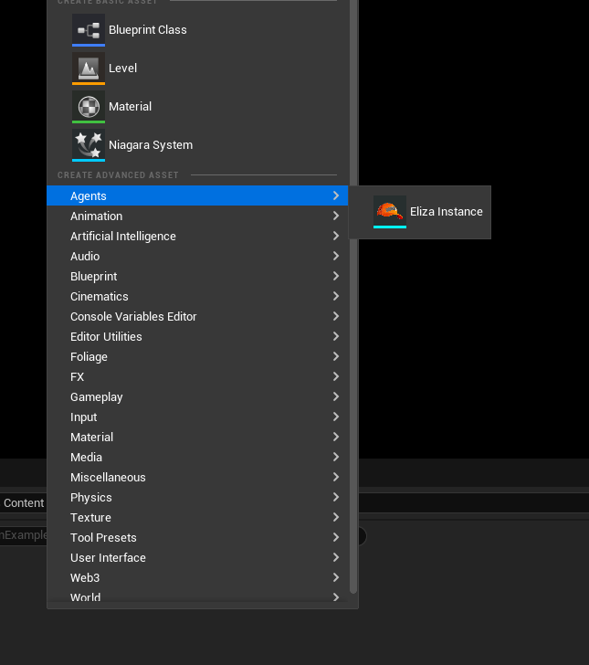
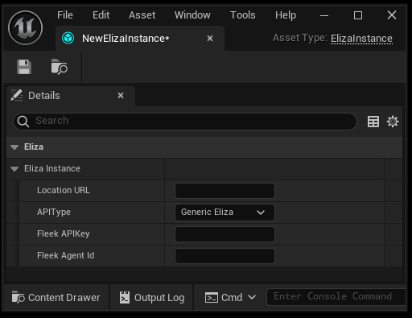

# Eliza Asset Types

The Eliza plugin introduced a number of new ways of managing information about Eliza instances. These take the form of game assets, which you can create similarly to how you would create a texture, material or blueprint. They can be found in the Add/Import menu (or right-clicking the background of the Content Browser):

There is a new type of asset under the "Agents" sub-menu: Eliza Instances.

## Eliza Instances

Eliza Instance assets are used by various methods and objects as a reference to an instance of ElizaOS, and how to connect to it and communicate with it.

These assets can be used as the input to any function that takes a ElizaInstance. Alternatively, should you need to fill in the details of an ElizaInstance on the fly (or from C++), you can create them using the [CreateElizaInstance](./APIs/CreateElizaInstance) method.