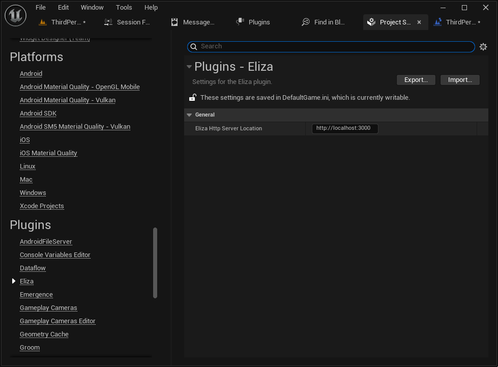

The plugin settings can be found in

`Project Settings` > `Plugins` > `Eliza`

There is currently only one setting, which is the "Eliza Http Server Location". This should be where your Eliza server is hosted, either locally or remotely. The default is "`http://localhost:3000`", which should be the default if you're hosting Eliza Locally.